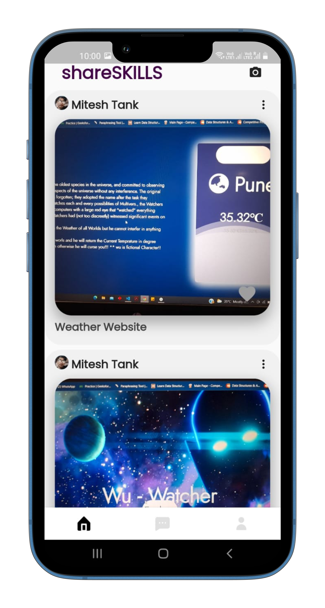
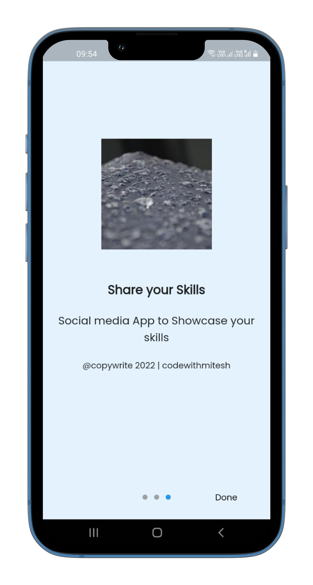
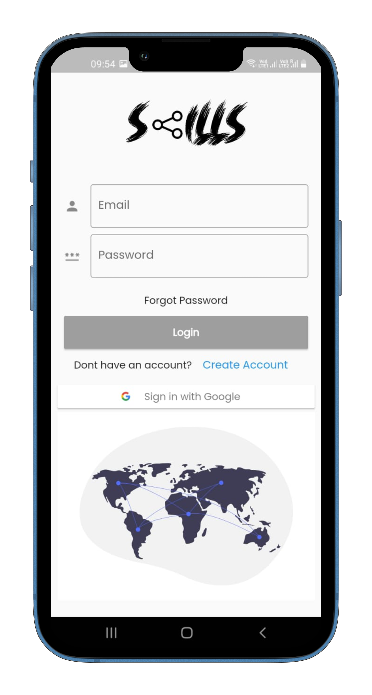
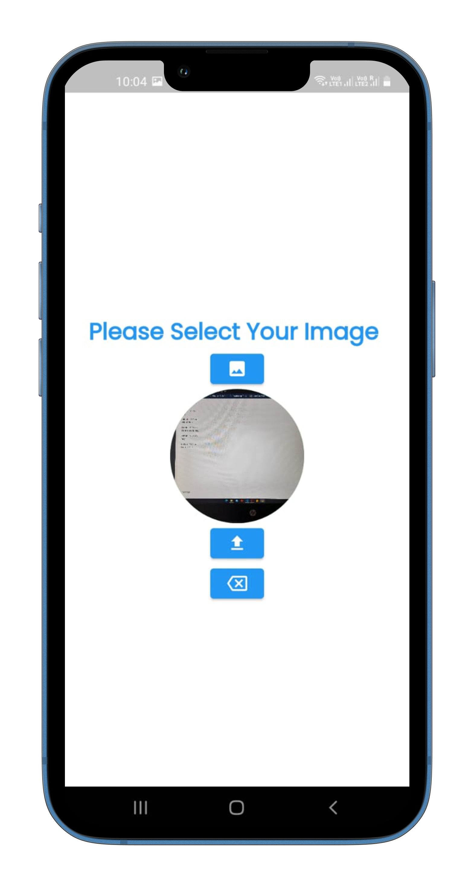
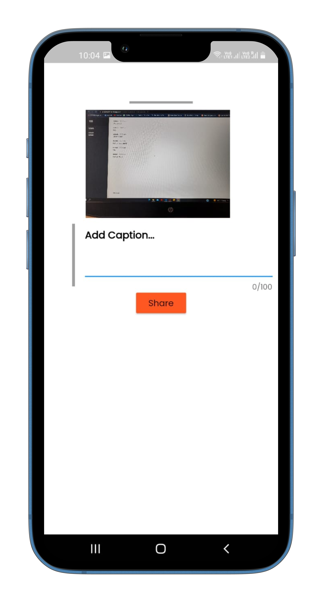
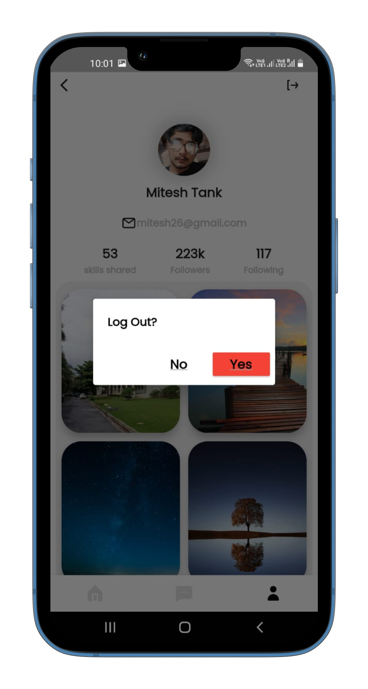

# Skillswag

A Social Media app to show skills and get swags
Be consistence with us ❤

- App Link: [Coming Soon]()
- Demo Video: [Coming Soon]()

## Learn Flutter 

This project is a starting point for a Flutter application. A few resources to get you started if this is your first Flutter project:

- [Lab: Write your first Flutter app](https://flutter.dev/docs/get-started/codelab)
- [Cookbook: Useful Flutter samples](https://flutter.dev/docs/cookbook)

For help getting started with Flutter, view our
[online documentation](https://flutter.dev/docs), which offers tutorials,
samples, guidance on mobile development, and a full API reference.

## Need Help 🚨
- We are building an initial release🤞 Our product will be launched very soon✔
- Need More Contributors and maintainers🤝
If intersted kindly contact [Here](#📬-contact)

## Table of contents

- [Overview](#overview)
  - [Screenshot](#screenshot)
  - [Links](#links)
- [Our process](#my-process)
  - [Built with](#built-with)
  - [What I learned](#what-i-learned)
  - [Continued development](#continued-development)
  - [Useful resources](#useful-resources)
- [Author](#author)
- [Acknowledgments](#acknowledgments)

## Overview

Skillswag is a social media application that allows you to showcase your skill set and earn swags. The primary goal of the app is to inspire users to learn and experiment with new skills while also maintaining consistency in skill development.
## My process

- Utilizing my abilities for cooperation and leadership, I carefully tackled the problem, brainstormed a solution, implemented it, and then released it.
- In order to excel Flutter development, I implemented small projects to improve my development skills.
- I designed and developed the application with my knowledge of Flutter.
- **All Links are in [Useful resources](#useful-resources).**

### What I learned

- Learned the complete Flutter Development
- Detailed understanding of the Flutter and Android Architecture
- Exploration of Google Firebase integration
- Combined the frontend and backend to make a working Flutter application
- Enhanced my teamwork and leadership skills

### Built with

- Flutter
- Firebase
## 🖥️ Tech Stack

**Frontend:**

&nbsp;

**Backend:**

&nbsp;

### 🚀 Features🔥

- User can login through App with email and password.-
- User can create account with gmail and login with gmail account also.
- User can share images with other and upload a post with caption.

### 😇 Upcoming Features🔥

- User can chat with ther users.
- User can like, comment and Give rewards to other's Post.
- User can share videos, pdfs, links and more.
- User can follow other users and get followers.
- User can maintain streak of daily work.

## Sneak Peek 🙈

<table>
<!-- <th></th> -->
  <tr>
    <td></td>
    <td></td>
  </tr>
  <tr>
    <td></td>
    <td></td>
  </tr>
  <tr>
    <td></td>
    <td></td>
  </tr>
  <tr>
    <td></td>
    <td></td>
  </tr>
</table>

## Useful resources

- [Flutter & Dart - The Complete Guide [2023 Edition]](https://www.udemy.com/course/learn-flutter-dart-to-build-ios-android-apps/) - This is the Udemy Course that i followed to learn Flutter Development.
- [Codepur](https://www.youtube.com/@HelloCodepur) - This is the Youtube Channel that i followed to learn Flutter In Hindi( Best YT channel for Flutter💙 ).
- Must Try :- [Official Documentation](https://docs.flutter.dev/)
- Also Some Online Blogs and Articles.

## 📬 Contact

If you want to contact me, you can reach me through below handles.

© 2022 Mitesh Tank ❤

